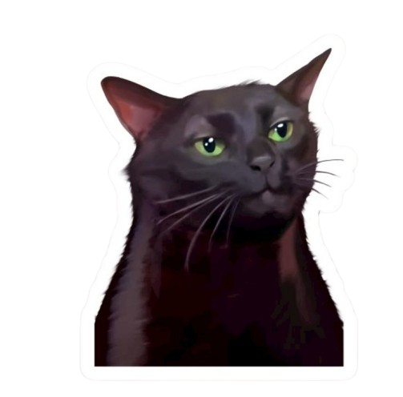

<p align="center">
  
</p>

<h1 align="center">GenieACS Parameter Configuration</h1>

<p align="center">
  Complete guide to backup and restore <b>GenieACS</b> parameter collections
  including <b>config</b>, <b>virtualParameters</b>, <b>presets</b>, and <b>provisions</b>
  using <b>Docker</b> and <b>MongoDB</b>.
</p>

<p align="center">
  
</p>

<p>
  
  
  
  
</p>

---

## Overview

This guide covers restoring GenieACS parameter collections from backup files into a running Docker container. Follow the steps below to get your configuration back up and running quickly.

---

## Prerequisites

Before starting, make sure you have:

- Docker & Docker Compose installed and running
- GenieACS container running (`genieacs-server`)
- Backup files available at `/genie-acs/parameter/`

---

## Cara Install Parameter

### 1. Copy Files ke Container

```bash
docker cp /genie-acs/parameter/ genieacs-server:/tmp/
```

### 2. Restore Collections

```bash
# Restore config
docker exec genieacs-server mongorestore \
  --db genieacs --collection config \
  --drop /tmp/parameter/config.bson

# Restore virtualParameters
docker exec genieacs-server mongorestore \
  --db genieacs --collection virtualParameters \
  --drop /tmp/parameter/virtualParameters.bson

# Restore presets
docker exec genieacs-server mongorestore \
  --db genieacs --collection presets \
  --drop /tmp/parameter/presets.bson

# Restore provisions
docker exec genieacs-server mongorestore \
  --db genieacs --collection provisions \
  --drop /tmp/parameter/provisions.bson
```

### 3. Restart GenieACS

```bash
cd /opt/genieacs-docker && docker-compose restart && sleep 15
```

---

## Collections Reference

| Collection | Description |
|---|---|
| `config` | General GenieACS configuration |
| `virtualParameters` | Virtual parameter definitions |
| `presets` | Preset task configurations |
| `provisions` | Provisioning scripts |

---

<div align="center">
  <p>Made by Alfannite for you hehe 😊</p>

  <a href="https://github.com/alfannite">
    
  </a>
  <a href="https://threads.net/@yeofanya">
    
  </a>
  <a href="https://instagram.com/alfan.niteops">
    
  </a>
  <a href="https://t.me/fannite_ops">
    
  </a>
  <a href="https://www.twitch.tv/fannitee">
    
  </a>
  <a href="https://discord.gg/LINK_INVITE_ATAU_USER">
    
  </a>
</div>